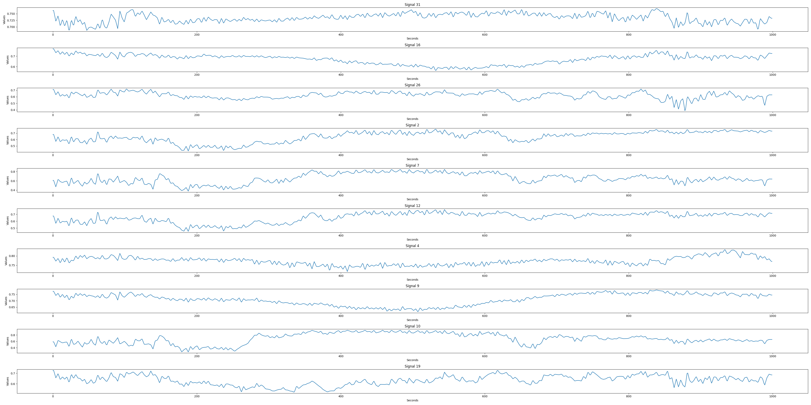
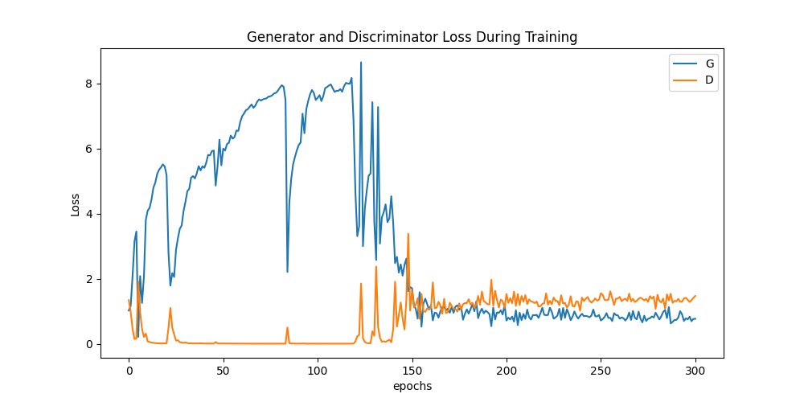

# FHR Signal Generation using CTGGAN

## Introduction

In this project, we have successfully developed a novel method for generating high-quality Fetal Heart Rate (FHR) signals.  The methodology leverages a 1D Convolutional Neural Network (CNN) trained with a Wasserstein Generative Adversarial Network (WGAN) equipped with Gradient Penalty (GP) to enhance the training stability and the quality of generated signals. Our approach significantly advances the synthesis of FHR signals, potentially aiding diverse clinical and research endeavors in fetal health analysis. The dataset used for this project can be downloaded from the following open-source repository: [CTU-UHB CTG Database](https://physionet.org/content/ctu-uhb-ctgdb/1.0.0/).

## Files

- `CTGGAN.py`: The main source code file containing the implementation of the GAN model for FHR signal generation.

## Visualization

### Generated Signal Samples

### Loss Function for Model Training

## Setup 

To set up and install the necessary environments and dependencies, follow the steps below:

1. Ensure that you have Python 3.9 and pytorch installed on your system. You can download it from [here](https://www.python.org/downloads/).
3. Clone the repository to your local machine.
3. Navigate to the project directory in your terminal.
4. Install the necessary packages mentioned in - `CTGGAN.py`
